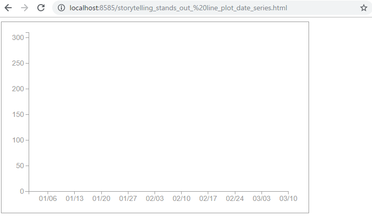
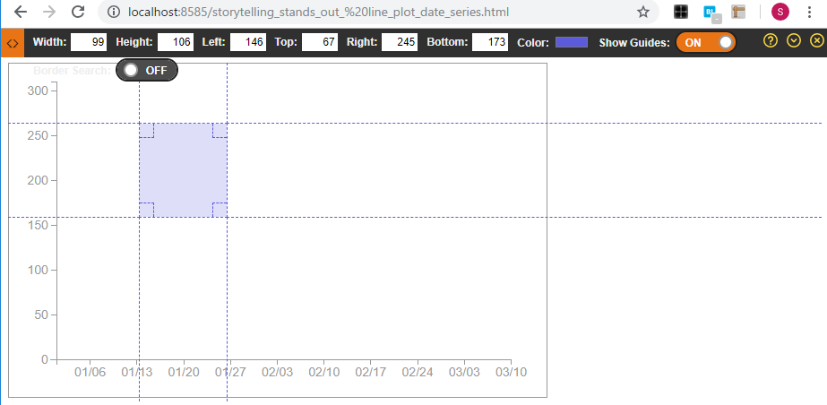

Files in this directory are used for temporary confirmation and trial and error. It is not used on the actual library.

# Start the local server

Perhaps it is useful to start the local server when checking the operation. If Python 3 is installed, it can be started with the following command:

```
$ cd plot_playground
$ cd mockup
$ python -m http.server 8585 &
```

You can check the contents by accessing "http://localhost:8585/your_html_file.html".



# Ruler and picker extension

For checking coordinates and sizes, it is useful to use Ruler's Chrome extension.  
e.g., [Page Ruler Redux](https://chrome.google.com/webstore/detail/page-ruler-redux/giejhjebcalaheckengmchjekofhhmal/related?hl=ja&)



Notes: If you do not access it on the local server it may not work well.

The Chrome Extension of [ColorPick Eyedropper](https://chrome.google.com/webstore/detail/colorpick-eyedropper/ohcpnigalekghcmgcdcenkpelffpdolg/related?hl=en) can also be useful for checking colors as well.